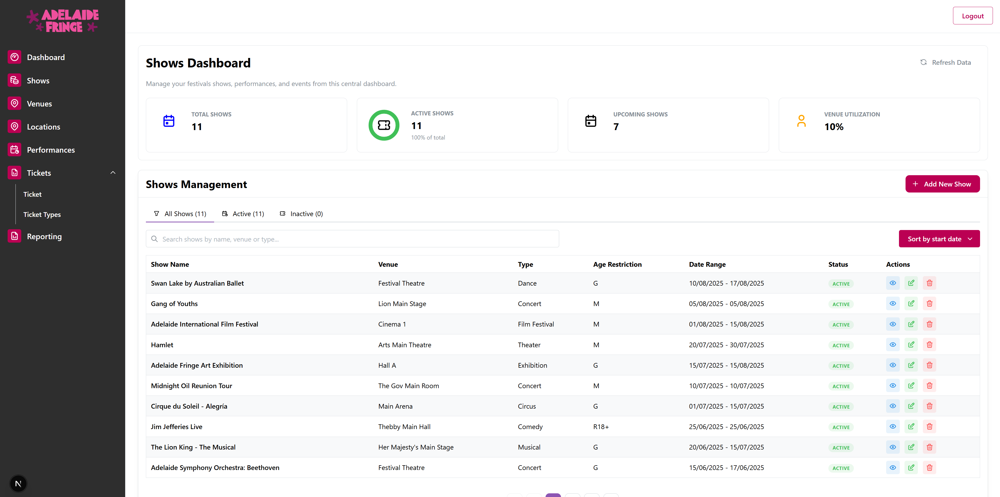
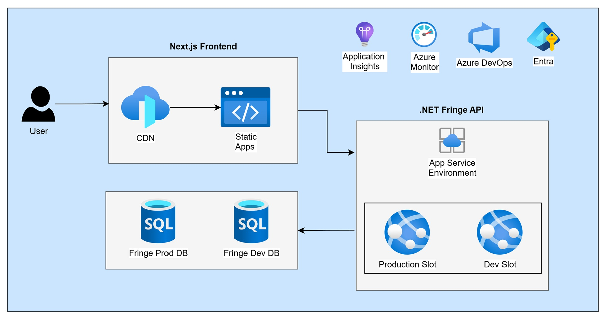
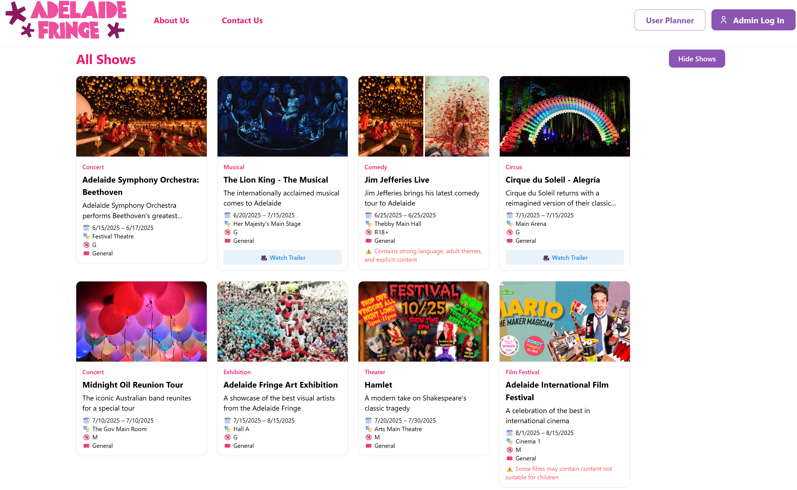

# 🎪 Fringe Festival Event Management Platform

**Full-stack event booking and management system for Australia's largest arts festival**

[](https://github.com/ndavidb/FringeBackend)
[](LICENSE)



## 🎯 Project Overview

A comprehensive event management platform designed to handle the complexity of large-scale arts festivals. Features dual interfaces for administrators and customers, real-time booking capabilities, and scalable cloud architecture.

### 🚀 Key Features

- **📊 Admin Dashboard** - Complete event and booking management with real-time analytics
- **🎫 Customer Portal** - Browse, book, and manage festival tickets seamlessly
- **⚡ Real-time Updates** - Live availability and booking confirmations
- **📱 Responsive Design** - Optimized for all devices and screen sizes
- **📈 Analytics Dashboard** - Event performance metrics and booking insights

### 🏗️ Architecture & Performance



**Built for scale:** Microservices architecture supporting thousands of concurrent users during peak festival periods.

## 💻 Tech Stack

| Category | Technologies |
|----------|-------------|
| **Frontend** | Next.js 14 • TypeScript • Mantine UI • React Query |
| **Backend** | .NET Core • RESTful APIs • Entity Framework |
| **Database** | PostgreSQL • Redis (caching) |
| **Cloud** | Azure App Services • Azure SQL Database |
| **DevOps** | Azure DevOps • Azure Pipelines (CI/CD) |

## 📱 Screenshots

### Admin Dashboard

*Complete event management interface with real-time booking analytics*

### Customer Experience

*Intuitive browsing and booking experience for festival attendees*

## 🚀 Quick Start

### Prerequisites

- Node.js 18.17.0 or higher
- npm or yarn package manager
- Git

### Installation & Setup

1. **Clone the repository**
   ```bash
   git clone https://github.com/ndavidb/FringeFront.git
   cd FringeFront
2. **Install dependencies**
   ```bash
   npm install
    # or
   yarn install
   ```
3. **Configure environment variables**
  ```bash
    NEXT_PUBLIC_API_URL=your-backend-url
  ```

### 🏗️ Project Structure
  ```bash
  fringe/
├── app/                    # Next.js App Router
│   ├── admin/             # Admin dashboard pages
│   │   ├── events/        # Event management
│   │   ├── bookings/      # Booking management
│   │   └── analytics/     # Performance metrics
│   ├── (public)/          # Customer-facing pages
│   │   ├── events/        # Event browsing
│   │   ├── booking/       # Booking flow
│   │   └── account/       # User account
│   └── layout.tsx         # Root layout & providers
├── components/            # Reusable UI components
│   ├── admin/            # Admin-specific components
│   ├── customer/         # Customer-facing components
│   └── shared/           # Common components
├── lib/                  # Utilities & configurations
│   ├── api/              # API client functions
│   ├── hooks/            # Custom React hooks
│   └── utils/            # Helper functions
├── styles/               # Global styles & themes
├── public/               # Static assets
└── tests/                # Test suites
```
### Deploy on Azure

- **Azure App Service**: Use the included `azure-pipelines.yml`


## 🔗 Related Projects

- **[Backend API](https://github.com/ndavidb/FringeBackend)** - .NET Core REST API with PostgreSQL

## 🛠️ Technical Highlights

### Performance Optimizations

- **Next.js 14 App Router** for improved routing and data fetching
- **React Query** for intelligent caching and background refetching
- **Image optimization** with Next.js Image component
- **Code splitting** and lazy loading for faster initial loads

### Developer Experience

- **TypeScript** with strict mode for type safety
- **ESLint & Prettier** for consistent code style

### Security Features

- **Authentication** with JWT tokens and refresh tokens
- **Authorization** with role-based access control (RBAC)
- **Data validation** on both client and server
- **HTTPS enforcement** and security headers

## 📊 Business Impact

### Problem Statement

Managing large-scale arts festivals with thousands of events, venues, and attendees requires robust, scalable technology solutions.

### Solution Benefits

- ⏱️ **60% reduction** in booking processing time
- 📈 **40% increase** in successful bookings through improved UX
- 💰 **30% reduction** in operational costs via automation
- 🎯 **99.9% uptime** during peak festival periods


## 📄 License

This project is licensed under the MIT License - see the [LICENSE](LICENSE) file for details.

## 📞 Contact & Collaboration

**David Bello** - Full Stack Developer

- 📧 Email: [david.bello2996@gmail.com](mailto:david.bello2996@gmail.com)
- 💼 LinkedIn: [linkedin.com/in/ndavidbello](https://linkedin.com/in/ndavidbello)
- 🐙 GitHub: [@ndavidb](https://github.com/ndavidb)

---

<div align="center">

*Built with ❤️ for the arts community in Adelaide, South Australia*

</div>

